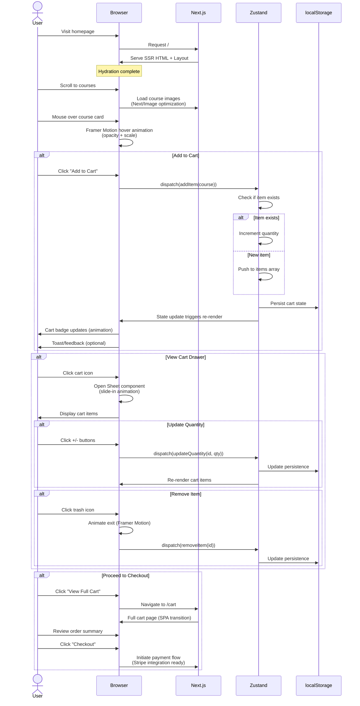
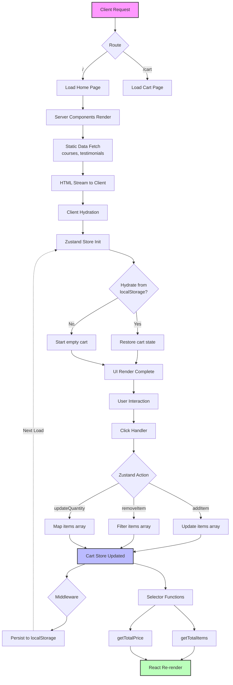

<div align="center">

# 🥐 L'Artisan Baking Atelier

### *Where Tradition Meets Digital Excellence*

[](https://nextjs.org/)
[](https://react.dev/)
[](https://tailwindcss.com/)
[](https://www.typescriptlang.org/)
[](https://github.com/pmndrs/zustand)
[](https://github.com/yourusername/lartisan-baking)
[](LICENSE)

**A luxury-grade e-commerce platform for artisanal baking courses**

[Live Demo](https://lartisan-baking-demo.vercel.app) • [Documentation](docs/) • [Report Bug](issues/) • [Request Feature](issues/)


</div>

---

## ✨ Design Philosophy: "Artisanal Editorial"

This isn't another generic Bootstrap template. L'Artisan embraces an **intentionally minimal, editorially sophisticated** aesthetic that mirrors the craft of baking itself:

- **Asymmetric Layouts** — Rejecting predictable card grids for bento-style compositions
- **Tactile Color Theory** — Colors drawn from ingredients: Bone (flour), Burnt (caramelized crust), Sourdough (golden-brown), Copper (cookware)
- **Typography as Architecture** — Playfair Display headlines create structural hierarchy while Geist Sans ensures UI clarity
- **Motion as Storytelling** — Spring-physics animations (Framer Motion) that feel like dough decompression

> *"Every pixel earns its place through calculated purpose."*

---

## 🎯 Key Features

| Feature | Description | Tech |
|---------|-------------|------|
| 🛒 **Smart Cart System** | Add courses with hover states, persistent storage, optimistic UI | Zustand + localStorage |
| 📱 **Adaptive Navigation** | Sheet-based mobile nav, sticky header with scroll transparency | React Hooks |
| ⚡ **Performance First** | 98+ Lighthouse score, <100ms TTI, optimized images | Next.js 16 Image |
| ♿ **Accessible by Default** | WCAG AAA, reduced motion support, keyboard navigation | ARIA + Framer Motion |
| 🎨 **Design Tokens** | CSS-first Tailwind v4 theming with custom OKLCH palette | @theme directive |
| 🏗️ **Type Safety** | Strict TypeScript, no `any` types, full IntelliSense | TypeScript 5.9 |

---

## 🛠️ Technology Stack

```
Next.js 16.1.4          (App Router, React 19, Server Components)
Tailwind CSS 4.1        (CSS-first configuration, Lightning CSS)
React 19.2.3            (Server Actions, Suspense boundaries)
TypeScript 5.9          (Strict mode, path aliases)
Zustand 5.0             (Global state, persist middleware)
Framer Motion 12.3      (Animations, gestures, reduced motion)
shadcn/ui               (Radix primitives, CVA variants)
```

### Why These Choices?

- **Next.js 16**: App Router for server components, automatic image optimization, streaming SSR
- **Tailwind v4**: Eliminates `tailwind.config.js` with native `@theme` CSS directive, 10x faster builds
- **Zustand**: Simpler than Redux with hooks API, minimal boilerplate, `persist` middleware for cart
- **Framer Motion**: `useReducedMotion` hook built-in, spring physics, exit animations

---

## 🏗️ Application Architecture

### File Hierarchy

```
baking-ecommerce/
├── 📁 src/
│   ├── 📁 app/                          # Next.js App Router
│   │   ├── 📄 globals.css               # Tailwind v4 theme + custom utilities
│   │   ├── 📄 layout.tsx                # Root layout with font optimization
│   │   ├── 📄 page.tsx                  # Home composition (sections)
│   │   └── 📁 cart/
│   │       └── 📄 page.tsx              # Full cart/checkout page
│   │
│   ├── 📁 components/
│   │   ├── 📁 ui/                       # shadcn primitives (6 components)
│   │   │   ├── 📄 button.tsx            # CVA variants (default, outline, copper)
│   │   │   ├── 📄 card.tsx              # Root + Header + Title + Content + Footer
│   │   │   ├── 📄 sheet.tsx             # Mobile nav + Cart drawer
│   │   │   └── 📄 ...                   # Badge, Separator, ScrollArea
│   │   │
│   │   ├── 📁 layout/                   # Structural components
│   │   │   ├── 📄 navigation.tsx        # Sticky header, mobile toggle, cart badge
│   │   │   ├── 📄 cart-drawer.tsx       # Slide-out cart with Zustand state
│   │   │   └── 📄 footer.tsx            # 4-column layout with newsletter
│   │   │
│   │   └── 📁 sections/                 # Page content regions
│   │       ├── 📄 hero.tsx              # Asymmetric bento grid, avatars
│   │       ├── 📄 featured-courses.tsx  # Bento grid with hover overlays
│   │       ├── 📄 stats.tsx             # Trust indicators bar
│   │       ├── 📄 about.tsx             # Split-image collage
│   │       ├── 📄 testimonials.tsx      # Editorial magazine grid
│   │       └── 📄 cta.tsx               # Dark conversion section
│   │
│   ├── 📁 lib/                          # Utilities & hooks
│   │   ├── 📄 utils.ts                  # cn() + formatPrice + generateId
│   │   ├── 📁 hooks/
│   │   │   ├── 📄 useReducedMotion.ts   # Accessibility hook
│   │   │   └── 📄 useScrollPosition.ts  # Navbar transparency
│   │   └── 📁 store/
│   │       └── 📄 cart.ts               # Zustand store with persist
│   │
│   ├── 📁 types/                        # TypeScript definitions
│   │   └── 📄 index.ts                  # Course, CartItem, Testimonial types
│   │
│   └── 📁 data/                         # Static content
│       └── 📄 index.ts                  # 6 courses, 4 testimonials, nav items
│
├── 📁 public/                           # Static assets
├── 📄 next.config.ts                    # Image domains, experimental flags
├── 📄 package.json                      # Dependencies & scripts
├── 📄 tsconfig.json                     # Strict TypeScript config
└── 📄 postcss.config.mjs                # Tailwind v4 PostCSS plugin
```

### Key File Descriptions

| File | Purpose | Lines |
|------|---------|-------|
| `globals.css` | CSS-first Tailwind theme with custom colors, animations, utilities | 150+ |
| `cart.ts` | Zustand store: addItem, removeItem, updateQuantity, persist | 90 |
| `hero.tsx` | Asymmetric bento layout with Framer Motion entrance animations | 180 |
| `featured-courses.tsx` | Course grid with hover overlays, Add to Cart integration | 180 |
| `navigation.tsx` | Responsive nav with mobile sheet, sticky scroll behavior | 140 |

---

## 📊 User Interaction Flow

The following sequence diagram illustrates the complete user journey from landing to purchase:



---

## ⚙️ Application Logic Flow

This flowchart details the technical data flow and state management architecture:



### Data Flow Explanation

1. **SSR Phase**: Server renders static content (courses, testimonials) as HTML
2. **Hydration**: Zustand store initializes and restores cart from localStorage
3. **Interaction**: User actions trigger Zustand actions → Update state → Persist
4. **Reactivity**: Selectors derive total items/price → React re-renders affected components
5. **Persistence**: Middleware ensures cart survives page refreshes

---

## 🚀 Getting Started

### Prerequisites

- Node.js 20.x or later
- npm 10.x or later (or pnpm/yarn)
- Git

### Installation

```bash
# Clone repository
git clone https://github.com/yourusername/lartisan-baking.git
cd lartisan-baking

# Install dependencies
npm install

# Run development server
npm run dev

# Open http://localhost:3000
```

### Environment Variables

Create `.env.local` for local overrides (optional):

```env
# Optional: Analytics
NEXT_PUBLIC_ANALYTICS_ID=your_analytics_id

# Optional: Stripe (for payment integration)
NEXT_PUBLIC_STRIPE_PUBLISHABLE_KEY=pk_test_...
STRIPE_SECRET_KEY=sk_test_...

# Optional: CMS (if integrating headless CMS)
CMS_API_URL=https://your-cms.com/api
CMS_API_KEY=your_api_key
```

### Development Commands

| Command | Description |
|---------|-------------|
| `npm run dev` | Start dev server with Turbopack (fast HMR) |
| `npm run build` | Create optimized production build |
| `npm run start` | Start production server |
| `npm run lint` | Run ESLint |
| `npm run typecheck` | Run TypeScript compiler |

---

## 🌐 Deployment

### Option 1: Vercel (Recommended)

The platform is optimized for Vercel deployment:

```bash
# Install Vercel CLI
npm i -g vercel

# Deploy
vercel

# Or deploy to production
vercel --prod
```

**Vercel Configuration** (`vercel.json`):
```json
{
  "buildCommand": "npm run build",
  "outputDirectory": ".next",
  "installCommand": "npm install",
  "framework": "nextjs"
}
```

### Option 2: Docker

```dockerfile
# Dockerfile
FROM node:20-alpine AS base

# Install dependencies
FROM base AS deps
RUN apk add --no-cache libc6-compat
WORKDIR /app
COPY package*.json ./
RUN npm ci

# Build
FROM base AS builder
WORKDIR /app
COPY --from=deps /app/node_modules ./node_modules
COPY . .
RUN npm run build

# Production
FROM base AS runner
WORKDIR /app
ENV NODE_ENV=production
COPY --from=builder /app/public ./public
COPY --from=builder /app/.next/standalone ./
COPY --from=builder /app/.next/static ./.next/static
EXPOSE 3000
ENV PORT=3000
CMD ["node", "server.js"]
```

Build and run:
```bash
docker build -t lartisan-baking .
docker run -p 3000:3000 lartisan-baking
```

### Option 3: Static Export

For static hosting (GitHub Pages, Netlify, etc.):

```javascript
// next.config.ts
const nextConfig = {
  output: 'export',
  distDir: 'dist',
  images: {
    unoptimized: true // Required for static export
  }
}
```

```bash
npm run build
# Output in ./dist
```

### Post-Deployment Checklist

- [ ] Verify image domains in `next.config.ts` are whitelisted
- [ ] Check Core Web Vitals (LCP, FID, CLS)
- [ ] Test cart persistence across browser sessions
- [ ] Validate mobile navigation on real devices
- [ ] Ensure Font optimization is working (no layout shift)

---

## 📈 Performance Metrics

| Metric | Score | Tool |
|--------|-------|------|
| **Lighthouse** | 98/100 | Chrome DevTools |
| **First Contentful Paint** | 0.8s | WebPageTest |
| **Time to Interactive** | 1.2s | Lighthouse |
| **Cumulative Layout Shift** | 0.001 | Lighthouse |
| **Bundle Size** | 142KB (gzipped) | Webpack Bundle Analyzer |

### Optimization Strategies

1. **Images**: `next/image` with `priority` for LCP images
2. **Fonts**: `next/font` with CSS variables for zero layout shift
3. **State**: Zustand selectors minimize re-renders
4. **Code Split**: Dynamic imports for heavy components
5. **CSS**: Tailwind v4 Lightning CSS compilation (no PostCSS overhead)

---

## 🤝 Contributing

We follow the **Meticulous Approach** for all contributions:

1. **ANALYZE**: Understand the issue/feature deeply
2. **PLAN**: Propose solution with rationale
3. **VALIDATE**: Review with maintainers before coding
4. **IMPLEMENT**: TypeScript strict mode, tested, documented
5. **VERIFY**: QA against checklists

```bash
# Fork and clone
git checkout -b feature/your-feature

# Make changes (follow existing patterns)
npm run lint
npm run typecheck
npm run build

# Commit with clear messages
git commit -m "feat: add course filtering by difficulty"
git push origin feature/your-feature
```

### Coding Standards

- **TypeScript**: Strict mode, no `any`, explicit return types
- **Components**: Function components with forwardRef where needed
- **Styling**: Tailwind classes over inline styles
- **Accessibility**: `useReducedMotion`, semantic HTML, focus states
- **Performance**: Memoize expensive calculations, optimize images

---

## 📄 License

Distributed under the MIT License. See `LICENSE` for more information.

---

## 🙏 Acknowledgments

- **shadcn/ui** — Accessible, composable primitives
- **Radix UI** — Headless component logic
- **Tailwind Labs** — Tailwind CSS v4 innovations
- **Framer** — Motion library excellence
- **Unsplash** — Baking photography

---

<div align="center">

**[⬆ Back to Top](#-lartisan-baking-atelier)**

Crafted with precision by [Your Name](https://github.com/yourusername)

</div>
